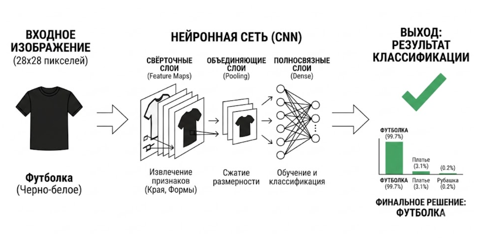

# Классификация одежды на базе Fashion-MNIST с использованием CNN и PyTorch

Этот проект представляет собой сквозное решение задачи многоклассовой классификации изображений одежды. Мы прошли путь от понимания основ компьютерного зрения до создания, обучения на GPU и глубокого анализа работы сверточной нейросети (CNN). Проект также включает инструмент для визуализации промежуточных активаций сети («карт признаков») при работе с произвольными пользовательскими изображениями.

##  Ключевые особенности проекта

1.  **Архитектура FashionCNN**: Реализована кастомная CNN на PyTorch с двумя сверточными слоями (`Conv2d`, `ReLU`, `MaxPool`) и полносвязным выходным слоем. Математика размерностей строго рассчитана для входных данных 28x28.
2.  **Эффективный конвейер обучения**:
    * **Оптимизатор Adam**: Использование адаптивного градиентного спуска для быстрой сходимости.
    * **Функция потерь CrossEntropyLoss**: Математически корректная обработка многоклассовой классификации без необходимости явного слоя Softmax в модели.
3.  **Визуализация и Анализ**:
    * Скрипт для предварительного просмотра случайных образцов датасета.
    * **Экспорт в ONNX**: Модель сохраняется в универсальный формат для просмотра архитектуры в Netron.
    * **Инструмент Инференса & «Понимания»**: Реализована функция `printCycle`, которая принимает пользовательское изображение (обработанное через OpenCV), нормализует его, инвертирует (черный фон) и визуализирует:
        * Входное изображение.
        * Активации (карты признаков) Слоя 1.
        * Активации Слоя 2 (абстрактные формы).
        * Гистограмму уверенности нейросети по всем 10 классам.

##  Стек технологий

* **Язык:** Python
* **Фреймворк ML:** PyTorch (torch, torchvision)
* **Обработка изображений:** OpenCV (cv2)
* **Визуализация:** Matplotlib, NumPy
* **Среда:** Jupyter Notebook / VS Code